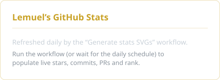
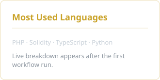

<!-- Banner: static fallback available at assets/header.svg -->

  

  

IT student and developer researcher at the University of the Immaculate Conception (Davao), building Laravel systems, EVM/Polygon tooling, and RAG applications for Philippine institutions. I work spec-first and direct AI coding agents to ship reliable, minimal software.

---

### 🔭 Currently building

- [**ChainVault**](https://github.com/LemuelAbellana/ChainVault) — credential/certificate vault anchoring document hashes on Polygon (Solidity + Foundry).
- [**ChainVault · Next.js dApp**](https://github.com/LemuelAbellana/ChainVault_NextJS) — the Next.js 14 front-end that issues and verifies ChainVault records.

### 🧩 What I work on

- **Backend** — Laravel 11 / PHP APIs, auth, and data models behind full-stack apps.
- **Blockchain** — Solidity contracts tested with Foundry, hash-anchored to Polygon.
- **AI / RAG** — retrieval pipelines with pgvector, Ollama embeddings, and Cohere reranking.
- **DevOps** — Docker-based deploys and self-hosting on VPS infrastructure.

### 📌 Featured

- [**ChainVault**](https://github.com/LemuelAbellana/ChainVault) — tamper-evident certificate verification via on-chain hash anchoring.
- [**ChainVault_NextJS**](https://github.com/LemuelAbellana/ChainVault_NextJS) — the Next.js 14 dApp front-end for ChainVault.
- [**SIA_Project**](https://github.com/LemuelAbellana/SIA_Project) — full-stack PHP application (Systems Integration & Architecture).
- [**Portfolio**](https://portfolio.lemuel-abellana.dev/) — projects, stack, and contact in one place.
<!-- Optional add — supply a one-line value prop, then uncomment:
- [**RPICV2**](https://github.com/LemuelAbellana/RPICV2) — <what it does>.
-->

---

### 🛠️ Tech Stack

**Backend & Web:**

**Blockchain:**

**AI / RAG:**

**DevOps & Tools:**

---

### 📊 GitHub in numbers

<!-- Stats + Top Languages: rendered from LOCAL committed SVGs refreshed daily by the "Generate stats SVGs" workflow. -->
<!-- We deliberately do NOT hotlink the live Vercel endpoints — they rate-limit and break on page load. -->

 

 

<!-- Contribution snake: self-generated on the `output` branch by the "Generate Snake" workflow → reliable, no third-party hotlink. -->
<picture>
  <source media="(prefers-color-scheme: dark)" srcset="https://raw.githubusercontent.com/LemuelAbellana/LemuelAbellana/output/github-contribution-grid-snake-dark.svg" />
  <source media="(prefers-color-scheme: light)" srcset="https://raw.githubusercontent.com/LemuelAbellana/LemuelAbellana/output/github-contribution-grid-snake.svg" />
  
</picture>

---

<!-- ── Contact row ─────────────────────────────────────────── -->

<!-- TODO: add LinkedIn once the profile URL is confirmed — do NOT guess the handle.

-->

<!-- ── Tagline + signature ─────────────────────────────────── -->

<i>Padayon</i> — building with purpose, from Davao.

<b>All for God's Glory</b>

